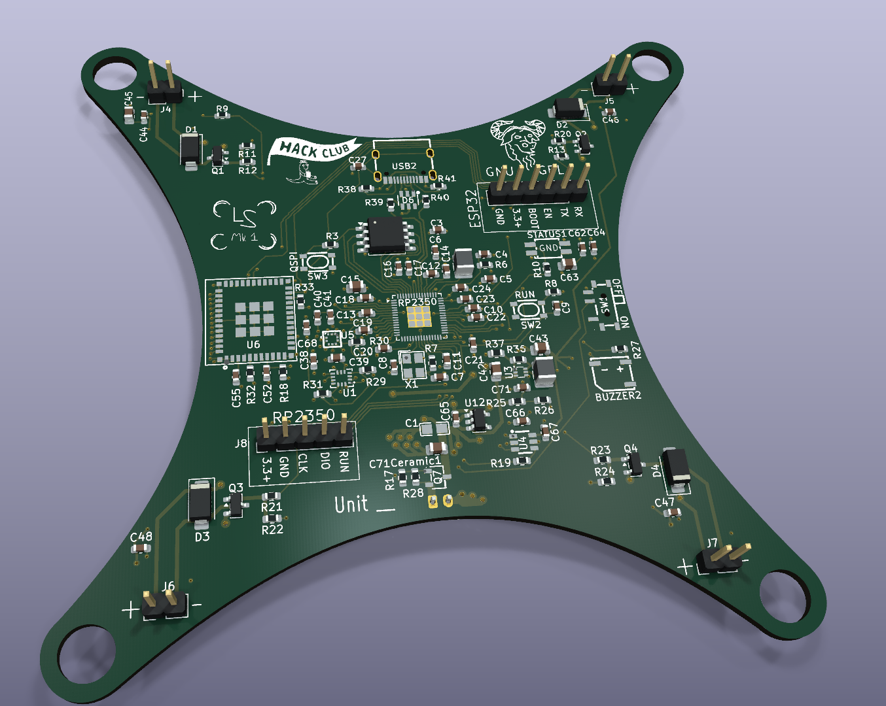
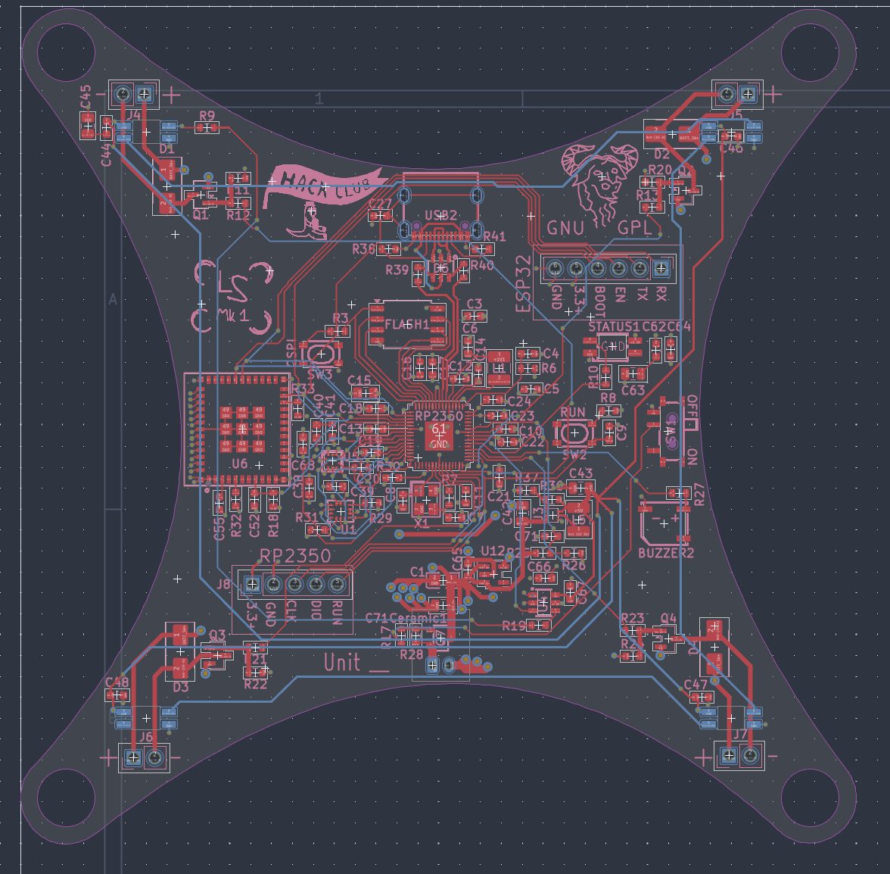
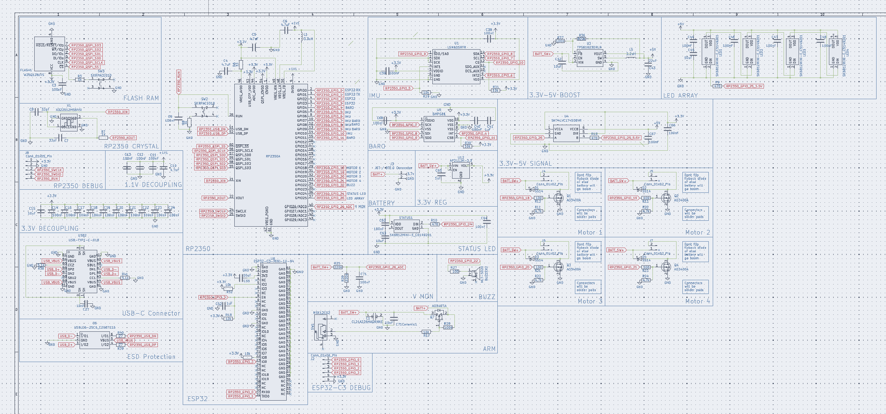

# LSwarm Mk.1
Micro-drone swarm as a light display

## Introduction
As of recently, drones are becoming a greater and greater commodity around the world. They serve a multitude of purposes in areas like photography and entertainment, often adding to the capabilities of that field.

Notably, one capability that many have a lack of access to are **3D (volumetric) displays**, often made from drones with expensive GPS systems and control systems. A swarm of these drones could cost **thousands of dollars** for even a basic display. 

The goal of the LSwarm Mark 1 is to provide a **cheap** alternative, approachable to everyone. Additionally, its all open sourced under the GNU GPL license! (do what you will with the code and designs but make sure to keep it open-source! :D)

### How will it localize without GPS?
Although the LS Mk.1 is still **experimental** (haven't even written the code yet), using a powerful IMU and barometer, the drones should be able to localize their position **accurately within a few centimeters**. Although sensor drift is a concern, I believe it could be minimized with proper calibration and a good startup sequence.

### Are drone swarms safe and legal?
Without a permit, flying more than one drone by yourself **outside** is **illegal** without a permit in most countries (especially the U.S.). However, in the U.S., flying **indoors** is technically not uncontrolled airspace and so FAA rules do not apply to it. Hence, in the U.S., **drone swarms** are completely **legal** as long as you **fly indoors** and **maintain safety precautions**. (Note: this is not legal advise, please check with your local government's rules and guidelines)

## Bill of Materials 

### (Minimum build for testing: 5 drones)

| Quantity | Components | Price | Link |
|--------- |----------|----------| -----|
| 20  | Brushed DC Motors | ~$9.68 | [here](https://www.aliexpress.us/item/3256810271706869.html?spm=a2g0o.productlist.main.48.18214690sK1aRt&algo_pvid=53df9bc5-14d9-4ef0-b69f-11a93d529ec5&algo_exp_id=53df9bc5-14d9-4ef0-b69f-11a93d529ec5-45&)
| 5  | 1s 450mAh BT2.0 Batteries | ~$11.21 | [here](https://www.aliexpress.us/item/3256810349502140.html?spm=a2g0o.productlist.main.9.7055TeWnTeWnyW&algo_pvid=e87d392e-a216-4ba3-8956-baf637a8cba3&algo_exp_id=e87d392e-a216-4ba3-8956-baf637a8cba3-8&pdp_ext_f=%7B%22order%22%3A%2248%22%2C%22eval%22%3A%221%22%2C%22fromPage%22%3A%22search%22%7D&pdp_npi=6%40dis%21USD%2113.57%216.78%21%21%2192.34%2146.17%21%402103110517771681621716757e4b37%2112000052738741335%21sea%21US%217493938711%21X%211%210%21n_tag%3A-29913%3Bd%3Ad260408f%3Bm03_new_user%3A-29895&curPageLogUid=6cUgOJiOwfNW&utparam-url=scene%3Asearch%7Cquery_from%3A%7Cx_object_id%3A1005010535816892%7C_p_origin_prod%3A)
| 1 | 1s BT2.0 Charger | ~18.18 | [here](https://www.aliexpress.us/item/3256811772590472.html?spm=a2g0o.productlist.main.3.315a3kxV3kxVU5&algo_pvid=a57de163-f3db-4a1d-966e-e88601147021&algo_exp_id=a57de163-f3db-4a1d-966e-e88601147021-2&pdp_ext_f=%7B%22order%22%3A%22-1%22%2C%22eval%22%3A%221%22%2C%22fromPage%22%3A%22search%22%7D&pdp_npi=6%40dis%21USD%2131.82%2119.09%21%21%21216.43%21129.86%21%402101f54117771690026201319e9264%2112000057143664294%21sea%21US%217493938711%21X%211%210%21n_tag%3A-29913%3Bd%3Ad260408f%3Bm03_new_user%3A-29895&curPageLogUid=pie8lE5eVKgd&utparam-url=scene%3Asearch%7Cquery_from%3A%7Cx_object_id%3A1005011958905224%7C_p_origin_prod%3A) 
|5 | 2.4G Wifi Antenna | ~$3.52 | [here](https://www.aliexpress.us/item/3256802833801038.html?spm=a2g0o.productlist.main.17.44bbCrBdCrBdFl&algo_pvid=20d56933-2b0c-45d5-8601-1bc6a9682401&algo_exp_id=20d56933-2b0c-45d5-8601-1bc6a9682401-16&pdp_ext_f=%7B%22order%22%3A%221074%22%2C%22eval%22%3A%221%22%2C%22fromPage%22%3A%22search%22%7D&pdp_npi=6%40dis%21USD%213.55%213.52%21%21%213.55%213.52%21%402101ef5e17781321493642302e40a6%2112000023272348781%21sea%21US%217493938711%21X%211%210%21n_tag%3A-29913%3Bd%3A21b1ce8d%3Bm03_new_user%3A-29895&curPageLogUid=rLnZuf4b98Bi&utparam-url=scene%3Asearch%7Cquery_from%3A%7Cx_object_id%3A1005003020115790%7C_p_origin_prod%3A)
| 5 | BMP581 (hand solder) | ~$20.34 | [here](https://www.lcsc.com/product-detail/C5362283.html?s_z=s_p_BMP581&spm=wm.ssy.bg.0.xh&lcsc_vid=EQdcXlMFQFgMVQUCQlALX1cFQVFeBlwHRgVYV1UAEwUxVlNRT1BfUFdfTlJcUDsOAxUeFF5JWBYZEEoKFBINSQcJGk4dAgUUFAk%3D)
| 5 | LSM6DSRTR (hand solder) | ~$17.33 | [here](https://www.lcsc.com/product-detail/C784817.html?s_z=s_q_LSM6DSR&spm=wm.ssy.bg.0.xh&lcsc_vid=EQdcXlMFQFgMVQUCQlALX1cFQVFeBlwHRgVYV1UAEwUxVlNRT1BfUFdTRFdfVDsOAxUeFF5JWBYZEEoKFBINSQcJGk4dAgUUFAk%3D)
| 5  | Mk.1 PCBs | ~$125 (with shipping, cost can vary widely however) | Download repo, extract fabrication files, and fabricate through JLCPCB (complete instructions for this may come soon)

Total cost: **$218.49**

Cost per drone: **$41.76**

----

### (Ideal build for full display: 20 drones)

| Quantity | Components | Price | Link |
|--------- |----------|----------| -----|
| 80  | Brushed DC Motors | ~$54.88  | [here](https://www.aliexpress.us/item/3256810271706869.html?spm=a2g0o.productlist.main.48.18214690sK1aRt&algo_pvid=53df9bc5-14d9-4ef0-b69f-11a93d529ec5&algo_exp_id=53df9bc5-14d9-4ef0-b69f-11a93d529ec5-45&)
| 20  | 1s 450mAh BT2.0 Batteries | ~$61.82  | [here](https://www.aliexpress.us/item/3256810349502140.html?spm=a2g0o.productlist.main.9.7055TeWnTeWnyW&algo_pvid=e87d392e-a216-4ba3-8956-baf637a8cba3&algo_exp_id=e87d392e-a216-4ba3-8956-baf637a8cba3-8&pdp_ext_f=%7B%22order%22%3A%2248%22%2C%22eval%22%3A%221%22%2C%22fromPage%22%3A%22search%22%7D&pdp_npi=6%40dis%21USD%2113.57%216.78%21%21%2192.34%2146.17%21%402103110517771681621716757e4b37%2112000052738741335%21sea%21US%217493938711%21X%211%210%21n_tag%3A-29913%3Bd%3Ad260408f%3Bm03_new_user%3A-29895&curPageLogUid=6cUgOJiOwfNW&utparam-url=scene%3Asearch%7Cquery_from%3A%7Cx_object_id%3A1005010535816892%7C_p_origin_prod%3A)
| 2 | 1s BT2.0 Charger | ~$36.36 | [here](https://www.aliexpress.us/item/3256811772590472.html?spm=a2g0o.productlist.main.3.315a3kxV3kxVU5&algo_pvid=a57de163-f3db-4a1d-966e-e88601147021&algo_exp_id=a57de163-f3db-4a1d-966e-e88601147021-2&pdp_ext_f=%7B%22order%22%3A%22-1%22%2C%22eval%22%3A%221%22%2C%22fromPage%22%3A%22search%22%7D&pdp_npi=6%40dis%21USD%2131.82%2119.09%21%21%21216.43%21129.86%21%402101f54117771690026201319e9264%2112000057143664294%21sea%21US%217493938711%21X%211%210%21n_tag%3A-29913%3Bd%3Ad260408f%3Bm03_new_user%3A-29895&curPageLogUid=pie8lE5eVKgd&utparam-url=scene%3Asearch%7Cquery_from%3A%7Cx_object_id%3A1005011958905224%7C_p_origin_prod%3A) 
| 20 | 2.4G Wifi Antenna | ~$14.08 | [here](https://www.aliexpress.us/item/3256802833801038.html?spm=a2g0o.productlist.main.17.44bbCrBdCrBdFl&algo_pvid=20d56933-2b0c-45d5-8601-1bc6a9682401&algo_exp_id=20d56933-2b0c-45d5-8601-1bc6a9682401-16&pdp_ext_f=%7B%22order%22%3A%221074%22%2C%22eval%22%3A%221%22%2C%22fromPage%22%3A%22search%22%7D&pdp_npi=6%40dis%21USD%213.55%213.52%21%21%213.55%213.52%21%402101ef5e17781321493642302e40a6%2112000023272348781%21sea%21US%217493938711%21X%211%210%21n_tag%3A-29913%3Bd%3A21b1ce8d%3Bm03_new_user%3A-29895&curPageLogUid=rLnZuf4b98Bi&utparam-url=scene%3Asearch%7Cquery_from%3A%7Cx_object_id%3A1005003020115790%7C_p_origin_prod%3A)
| 20 | BMP581 (hand solder) | ~$74.76 | [here](https://www.lcsc.com/product-detail/C5362283.html?s_z=s_p_BMP581&spm=wm.ssy.bg.0.xh&lcsc_vid=EQdcXlMFQFgMVQUCQlALX1cFQVFeBlwHRgVYV1UAEwUxVlNRT1BfUFdfTlJcUDsOAxUeFF5JWBYZEEoKFBINSQcJGk4dAgUUFAk%3D)
| 20 | LSM6DSRTR (hand solder) | ~$60.13 | [here](https://www.lcsc.com/product-detail/C784817.html?s_z=s_q_LSM6DSR&spm=wm.ssy.bg.0.xh&lcsc_vid=EQdcXlMFQFgMVQUCQlALX1cFQVFeBlwHRgVYV1UAEwUxVlNRT1BfUFdTRFdfVDsOAxUeFF5JWBYZEEoKFBINSQcJGk4dAgUUFAk%3D)
| 20  | Mk.1 PCBs | ~$200 (with shipping, cost can vary widely however) | Download repo, extract fabrication files, and fabricate through JLCPCB (complete instructions for this may come soon)

Total cost: **$562.95**

Cost per drone: **$25.40**

----

## Tools / Other parts:
- Raspberry PI Zero 2 W or equivalent (or just a computer/laptop)
- Hot-air reflow station or SMD hot plate
- Solder paste for SMD components
- Tweezers for SMD components
- Soldering iron + solder
- Wire strippers/cutters
- Zipties, tape, or velcro straps
- Hot glue + hot glue gun

## Assembly
1. Apply solder paste onto the smd joints for the BMP581 and LSM6DSRTR.
2. Carefully align the components and place using tweezers
3. Use a hot-air gun (preferred over smd hot plate to not mess up any other components) on high heat to quickly heat up the solder paste (prolonged heat may damage components)
4. Fit motors into mounting holes (make sure they are aligned properly on all sides) use wire strippers to cut and solder on motor wires. Apply hot glue or equivalent to the motors to keep them in place.
5. Use wire strippers to cut and solder on battery connector wires to PCB.
6. Attach battery with velcro, zipties, or tape.
7. Plug in battery and flash software with the USB-C port.